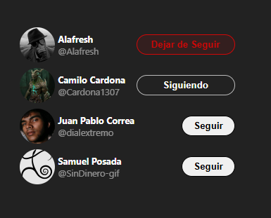

# Twitter Follow Card con React

Este proyecto es una implementación de una **tarjeta de seguimiento** al estilo de Twitter, desarrollada con **React**. Fue creada con propósitos educativos y de práctica con hooks como `useState`.

## 🖼️ Vista Previa



## 🚀 Tecnologías utilizadas

- React
- CSS para el diseño
- `useState` para manejar el estado de seguimiento

## 📂 Instalación y uso

1. **Clonar el repositorio:**

   ```sh
   git clone https://github.com/tu-usuario/TwitterFollowCard.git
   cd TwitterFollowCard
   ```

2. **Instalar dependencias:**

   ```sh
   npm install
   ```

3. **Ejecutar el proyecto:**

   ```sh
   npm run dev
   ```

4. **Abrir en el navegador:**
   Normalmente se ejecuta en `http://localhost:5173/` (o el puerto que indique la terminal).

## ✨ Características

- Interfaz inspirada en Twitter.
- Botón cambia de estado entre "Seguir" y "Siguiendo" con `useState`.
- Estilos personalizados para mejorar la experiencia visual.

## 📜 Licencia

Este proyecto es solo para propósitos de aprendizaje y no tiene fines comerciales.

---

📌 **Nota:** Si quieres modificar el código o mejorar el diseño, siéntete libre de hacerlo. ¡Cualquier feedback es bienvenido! 🚀
